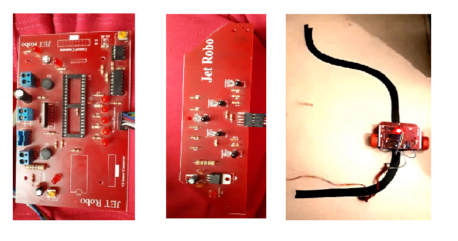
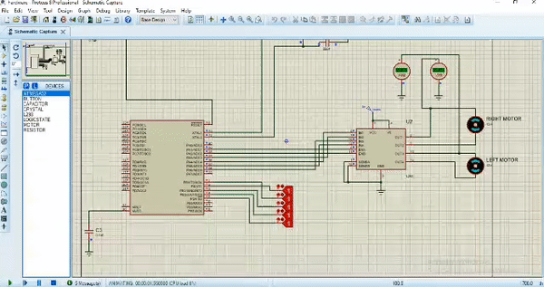

# Line-follower-robot
There are five IR sensors on robot. When the sensor senses white surface then Arduino gets 1 as input and when senses black line Arduino gets 0 as input.

# Project team
[@zamanighazaleh](https://github.com/zamanighazaleh)

[@SaraBaradaran](https://github.com/SaraBaradaran)
